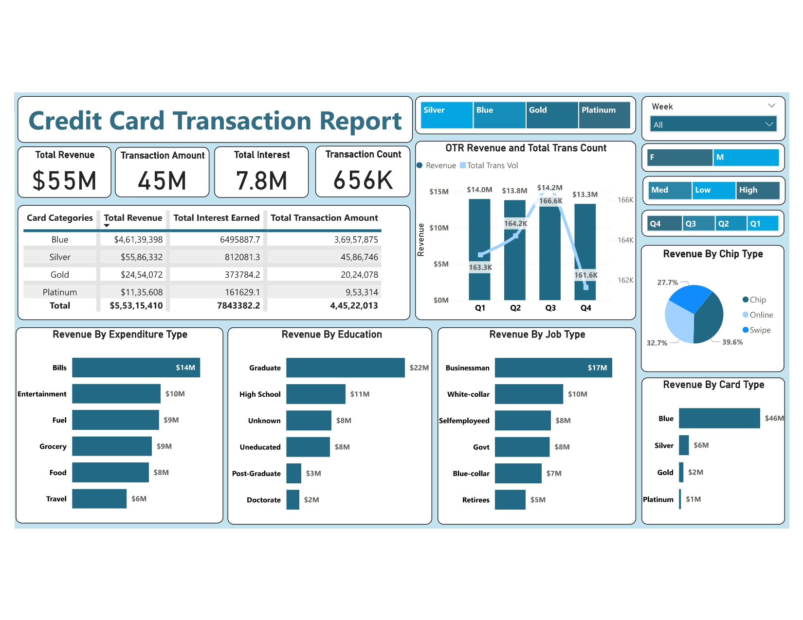
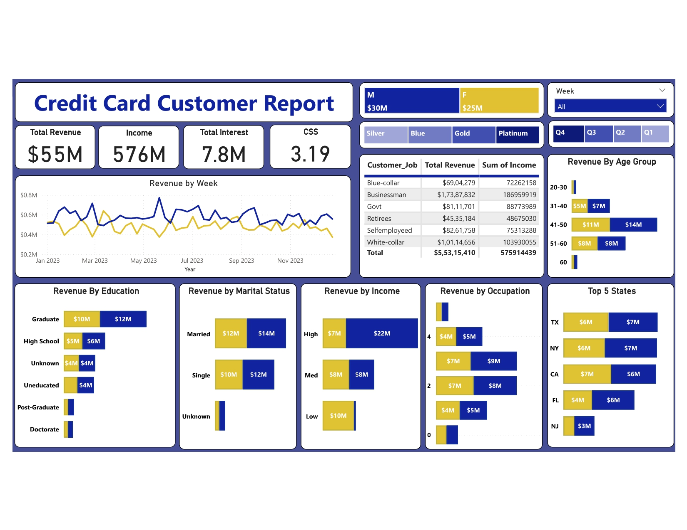

# 📊 Credit Card Financial Dashboard in Power BI

This project includes two interactive Power BI dashboards:
- **Credit Card Transaction Report**
- **Credit Card Customer Report**

These dashboards provide comprehensive insights into credit card operations, enabling real-time tracking of revenue, transactions, customer behavior, and geographic trends.

---

## 🚀 Project Objective

To develop a **credit card weekly dashboard** that provides real-time insights into key performance metrics and trends, enabling stakeholders to monitor and analyze credit card operations effectively.

---

## 🛠️ Tech Stack

- **Power BI** for visualization and interactive dashboard development
- **SQL** for data preparation and querying
- **DAX** for custom metrics and calculated columns

---

## 📥 Data Source

Data used in the dashboard includes:
- Transaction details
- Customer profiles
- Credit card attributes

The data was imported from CSV files into a SQL database, cleaned, and then loaded into Power BI using Power Query.

🔗 [Download DataSet File](https://drive.google.com/drive/folders/1WWlj4c8QK7Y6reATnpavbnRSSL2G_c6e?usp=share_link)

---

## 📊 Dashboards Preview

### 1️⃣ Credit Card Transaction Report

### 2️⃣ Credit Card Customer Report

---

## 🔎 Key Insights

📅 **Week 52 (23rd Dec):**
- 📈 Revenue increased by **28.8%**
- 💳 Total transaction amount & count increased significantly
- 👥 Customer count growth

📅 **Year-to-Date Overview:**
- 🏦 Total revenue: **$55M**
- 💰 Total interest earned: **$7.8M**
- 💵 Total transaction amount: **$45M**
- 👨‍💼 Male customers contributed **$30M**, females **$25M**
- 💳 Blue & Silver cards account for **93%** of transactions
- 🌍 TX, NY & CA contribute **68%** of revenue
- ✅ Activation Rate: **57.5%**

---
## 👤 Author

**Agamjot Singh**  
_Data Analyst _

---

